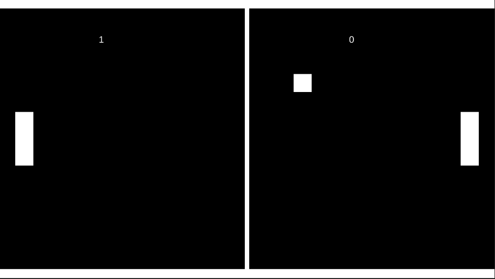

# Unity_PongGame



## About 

This is a simple pong game built with Unity and written in C#. It consists of one mode which is essentially player versus player.

## Controls

For the player on the left-hand side

```
To move paddle up press: 'w'

To move paddle down press: 's'
```

For the player on the right-hand side

```
To move paddle up press: '↑'

To move paddle down press: '↓'
```
## Installation
To run the game on your local machine, follow these steps:
```
1. Clone the repository or download the source code as a ZIP file.

2. Open Unity and navigate to the project folder.

3. Open the project in Unity by selecting the folder and clicking "Open."

4. Once the project is open, navigate to the "Scenes" folder and open the "Main" scene.

5. Connect a supported platform (such as your mobile device or Unity's Play Mode) to run the game.

6. Build and run the project.
```
